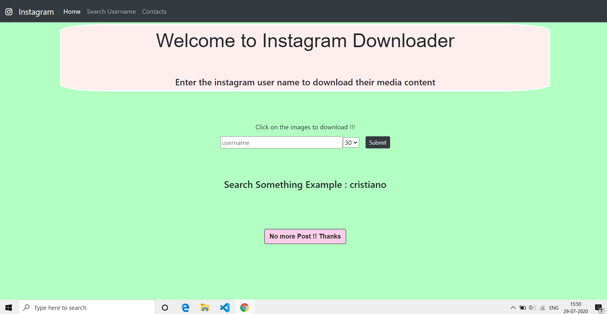
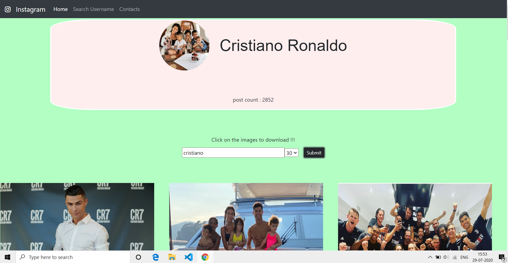
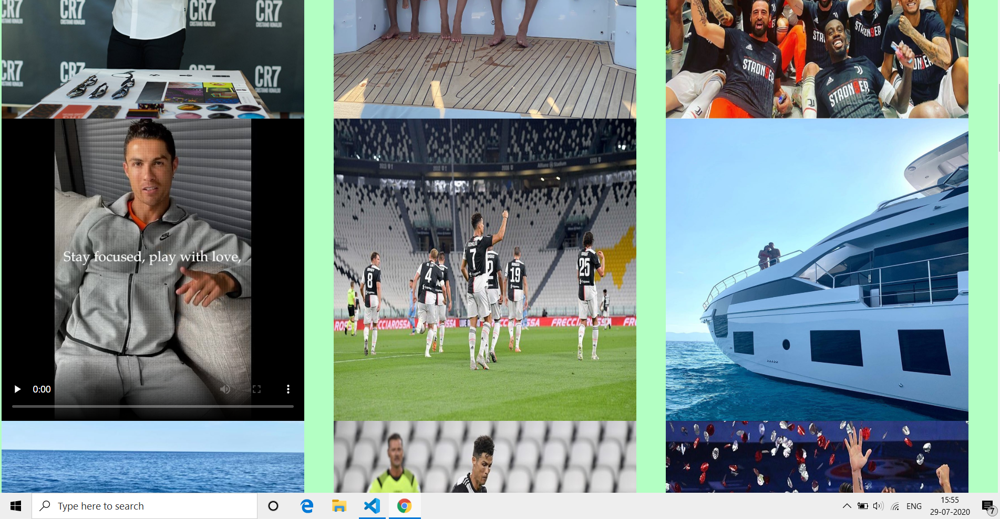
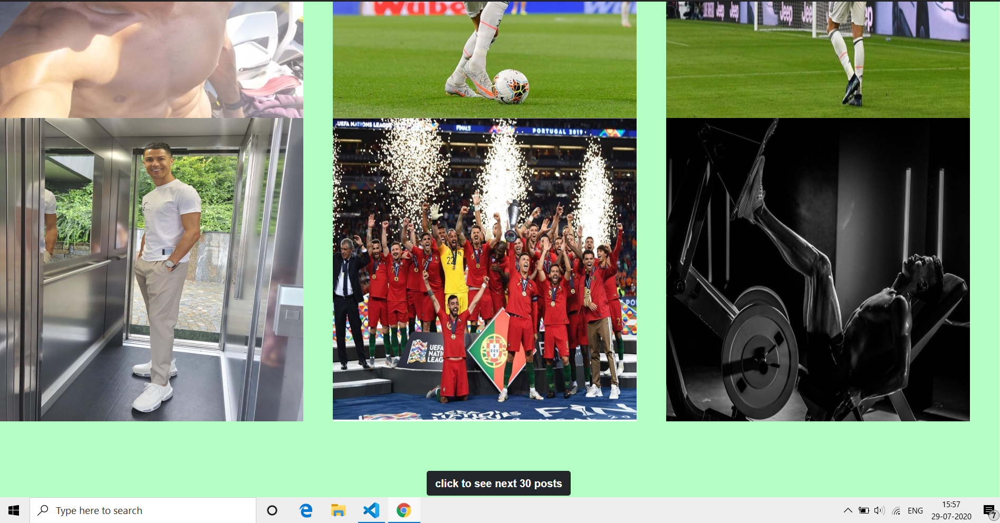
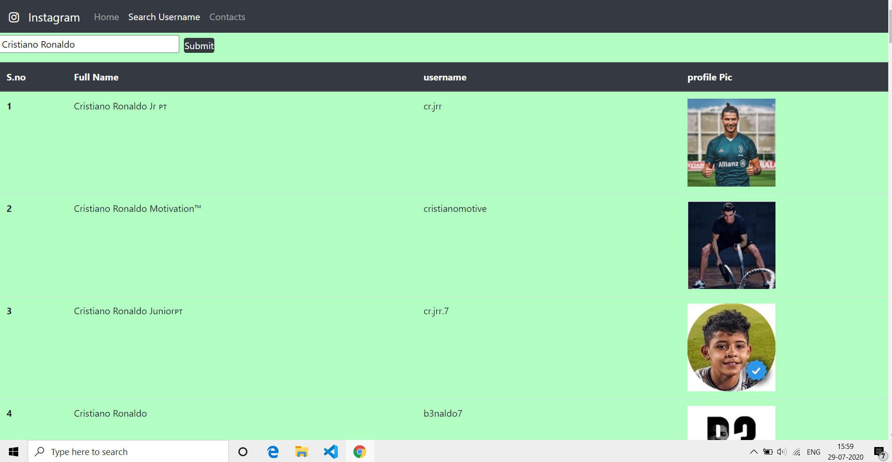

# Instagram Downloader
Now you can download all the Photos and Videos of an Instagram User.No Restriction or limitations.Just enter the User name and Start!!!.You can also for search User name here.
# How to use
## Local Computer
+ You must have node installed in your computer
1. Open terminal in VScode or Command prompt or shell etc
2. git clone https://github.com/shubham1898/instagram-Downloader-react.git
3. npm install
4. node app.js
5. open your web bowser and search localhost:3000

## Online
  Just click http://instagram-downloader1.herokuapp.com/

# Demo

# Info
Feel free to contribute to any improvement

# Notes
1. User account must be public
2. Unlimited access to Photos and videos of an IG user
